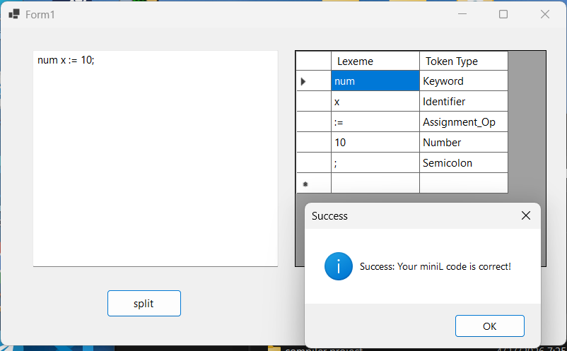
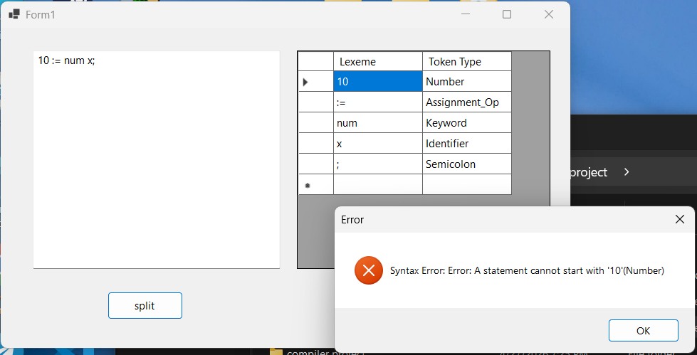

# MiniL Compiler Project - Phase 2

## Overview
This repository contains the second phase (Phase 2) of the MiniL compiler project, developed for the **Compiler Design & Theory (CS321)** course at **El-Shorouk Academy**. [cite_start]This phase focuses on implementing the Lexical Analyzer (Scanner) and the Syntax Analyzer (Parser) using C# to validate the structural correctness of the `minil` programming language .

## Key Features
* [cite_start]**Lexical Analysis (Scanner):** Tokenizes the source code into meaningful units (Lexemes) and classifies them into categories like Keywords, Identifiers, Numbers, and Operators .
* [cite_start]**Syntax Analysis (Parser):** Implements a Recursive Descent Parser to ensure the token sequence follows the predefined Context-Free Grammar (CFG) .
* [cite_start]**Robust Error Handling:** Detects syntax errors immediately and provides descriptive feedback (e.g., "A statement cannot start with a Number") .
* [cite_start]**User Interface:** Displays the extracted Lexemes and their corresponding Token Types in an organized `DataGridView` for easy debugging .

## Execution Snapshots

| Case | Snapshot |
| :--- | :--- |
| **Valid Structure (Success)** |  |
| **Syntax Error (Failure)** |  |

## Supported Grammar (CFG)
[cite_start]The parser validates the following grammar rules :
- **Variable Declarations & Assignments:** e.g., `num x := 10;`.
- **Conditional Statements (Check):** `check (Condition) then { Statements } otherwise { Statements }`.
- **Loop Structures (Repeat):** `repeat { Statements } until (Condition)`.
- **Arithmetic & Relational Expressions:** Supports all levels of operations and relational operators (`<, >, ==, !=`).

## Installation & How to Run
1.  **Clone the Repository:**
    ```bash
    git clone [https://github.com/mohamed-nasef4/MiniL-Compiler-Parser](https://github.com/mohamed-nasef4/MiniL-Compiler-Parser)
    ```
2.  **Open in Visual Studio:** Locate the `.sln` file and open it.
3.  **Run the Application:** Press `F5` to build and start the program.
4.  **Test the Parser:** Enter your `minil` code in the text box and click the **Split** button to see the results.

## Project Team

| Name | Section | ID |
| :--- | :--- | :--- |
| Mohamed Ahmed Mohamed Abdullatif | 11 | 324243585 |


---
**Supervised by CS321 Course Faculty - El-Shorouk Academy**